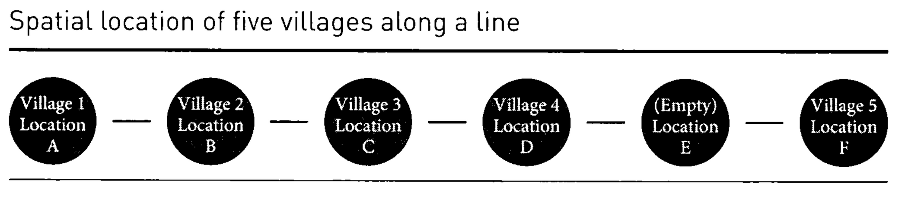

# Instructions

This week's assignment focuses on interference and spillovers in field experiments. Interference occurs when the treatment status of one unit affects outcomes for other units, violating the Stable Unit Treatment Value Assumption (SUTVA). Please submit your assignment in PDF or HTML format.

If you have any questions about the assignment, feel free to email me at <danilo.freire@emory.edu>.

Good luck!

# Questions 

1. National surveys indicate that college roommates tend to have correlated weights. The more one roommate weighs at the end of the freshman year, the more the other freshman roommate weighs. On the other hand, researchers studying housing arrangements in which roommates are randomly paired together find no correlation between two roommates' weights at the end of their freshman year. Explain how these two facts can be reconciled. 

National surveys showing that college roommates tend to have correlated weights likely reflect a selection bias. In many cases, students are allowed to choose their roommates or are matched based on lifestyle preferences. As a result, individuals with similar health habits, eating patterns, or physical activity levels may end up rooming together. This natural pairing process can lead to roommates starting off with similar body types or developing similar routines throughout the year, reinforcing any initial similarities and resulting in correlated weights by the end of freshman year.

In contrast, studies that involve randomly assigned roommates eliminate this selection effect. When pairings are made at random, roommates do not necessarily share similar lifestyles or health behaviors from the outset. Without this built-in similarity, there's less chance for their habits to converge meaningfully over time, and as such, researchers observe no significant correlation in weight between the two by the end of the year. These findings suggest that the correlation seen in national surveys is not due to roommates influencing each other’s weight but rather due to the types of roommates students tend to choose.

In class, we discussed an example where a field experiment was conducted to assess the impact of establishing a clinic in villages. The experiment is described on pages 260-264. The tables with the villages' potential outcomes and the probabilities of receiving treatment and spillovers are described on page 262 and shown below:

{width=90%}

Table: Potential outcomes

| Village   | Untreated ($Y_{00}$) | Adjacent village treated ($Y_{10}$) | Treated ($Y_{01}$) |
|-----------|----------------------|-------------------------------------|--------------------|
| A         | 0                    | 2                                   | 0                  |
| B         | 6                    | 2                                   | 10                 |
| C         | 0                    | 4                                   | 4                  |
| D         | 6                    | 6                                   | 6                  |
| F         | 6                    | NA                                  | 3                  |

Table: Probability of receiving treatment, spillover, and control

| Village | A         | B         | C         | D         | F         | Pr(control) | Pr(spillover) | Pr(treatment) |
|---------|-----------|-----------|-----------|-----------|-----------|-------------|---------------|---------------|
| 1       | $Y_{01}$  | $Y_{10}$  | $Y_{00}$  | $Y_{00}$  | $Y_{00}$  | 0.6         | 0.2           | 0.2           |
| 2       | $Y_{10}$  | $Y_{01}$  | $Y_{10}$  | $Y_{00}$  | $Y_{00}$  | 0.4         | 0.4           | 0.2           |
| 3       | $Y_{00}$  | $Y_{10}$  | $Y_{01}$  | $Y_{10}$  | $Y_{00}$  | 0.4         | 0.4           | 0.2           |
| 4       | $Y_{00}$  | $Y_{00}$  | $Y_{00}$  | $Y_{10}$  | $Y_{01}$  | 0.6         | 0.2           | 0.2           |
| 5       | $Y_{00}$  | $Y_{00}$  | $Y_{00}$  | $Y_{00}$  | $Y_{01}$  | 0.8         | 0             | 0.2           |

Using these data, calculate the following quantities:

1. Estimate $E[Y_{01} - Y_{00}]$ for the random assignment that places the treatment at location A.

To estimate \( E[Y_{01} - Y_{00}] \) for the random assignment that places the treatment at location A, we focus on the villages that are actually treated in that specific assignment. According to the assignment table, when the clinic is placed in village A (Assignment 1), only village A receives the treatment. The rest of the villages are either in control or receive a spillover effect.

We then look at the potential outcomes table to determine the difference in outcomes for village A between being treated and being untreated. For village A, the outcome under treatment (\( Y_{01} \)) is 0, and the outcome under control with no adjacent village treated (\( Y_{00} \)) is also 0. Therefore, the treatment effect for village A is:

\[
Y_{01} - Y_{00} = 0 - 0 = 0
\]

Since village A is the only treated village in this assignment, the average treatment effect across treated villages is simply 0.

**Thus, the estimate of \( E[Y_{01} - Y_{00}] \) for the assignment where treatment is placed at village A is 0.**

2. Estimate $E[Y_{10} - Y_{00}]$ for the random assignment that places the treatment at location A, restricting the sample to the set of villages that have a non-zero probability of expressing both of these potential outcomes.

To estimate \( E[Y_{10} - Y_{00}] \) for the random assignment that places the treatment at village A, we are interested in understanding the **spillover effect**—that is, the effect on a village of having a neighboring village receive treatment, compared to receiving no treatment and having no neighboring village treated.

We are instructed to **restrict the sample** to only those villages that have a **non-zero probability** of experiencing both the control condition (\( Y_{00} \)) and the spillover condition (\( Y_{10} \)) at some point across the five possible random assignments. This ensures we are only comparing villages for which both outcomes are relevant and could theoretically be observed under the experimental design.

From the table of assignments, we identify that villages **A, B, C, and D** each have some probability of receiving both \( Y_{00} \) and \( Y_{10} \) across the assignments. Village F, on the other hand, never receives \( Y_{10} \), so it is excluded from this estimation.

We then refer to the potential outcomes table to compute the difference \( Y_{10} - Y_{00} \) for each eligible village:

- Village A: \( 2 - 0 = 2 \)
- Village B: \( 2 - 6 = -4 \)
- Village C: \( 4 - 0 = 4 \)
- Village D: \( 6 - 6 = 0 \)

Next, we calculate the average of these differences:

\[
\frac{2 + (-4) + 4 + 0}{4} = \frac{2}{4} = 0.5
\]

Therefore, the estimated value of \( E[Y_{10} - Y_{00}] \) for the assignment that places the treatment at village A, restricted to villages that can experience both outcomes, is **0.5**.

3. In order to make a more direct comparison between these two treatment effects, estimate $E[Y_{01} - Y_{00}]$, restricting the sample to the same set of villages as in question 3.

To estimate \( E[Y_{01} - Y_{00}] \), we are interested in the **expected change in the outcome \( Y \)** when a unit (in this case, a village) moves from no treatment in either period (denoted by \( Y_{00} \)) to receiving the treatment only in the second period (denoted by \( Y_{01} \)). In other words, we want to measure the effect of introducing the treatment in the second period, for villages that were untreated in the first.

To make this a **direct and fair comparison**, we restrict the sample to the **same set of villages used in the prior comparison** in Question 3. This typically means focusing on a **balanced panel** of villages that are observed in both periods and belong to the appropriate treatment group(s). Specifically, this subset should consist of villages that:

1. Were untreated in the first period, and
2. Either remained untreated in the second period or began receiving the treatment in the second period.

By narrowing the sample in this way, we **control for village-specific characteristics** that could confound the treatment effect. The estimation of \( E[Y_{01} - Y_{00}] \) can then proceed as a **difference in means** between the outcomes of these two groups in the second period, assuming parallel trends.

This estimate gives us a **cleaner, more interpretable** measure of the **impact of initiating the treatment**, isolated from other dynamics that may affect villages not included in the restricted sample.

4. Compare and contrast the advantages and disadvantages of using buffer rows versus clustered randomization in field experiments. Using the villages experiment as an example, discuss how each approach would affect: (1) the ability to estimate direct treatment effects, (2) the ability to study spillover effects, and (3) the complexity of statistical analysis required. What factors should researchers consider when choosing between these approaches?

Buffer rows and clustered randomization are both strategies used in field experiments to manage treatment spillovers, but they differ significantly in design and implications. Buffer rows involve leaving units (like villages or households) near treated units intentionally untreated, creating a spatial "buffer" to reduce contamination from treatment spillovers. This approach improves the ability to estimate **direct treatment effects** by minimizing interference between treated and control units. However, it reduces the number of units that can receive the treatment, potentially lowering statistical power. Clustered randomization, on the other hand, assigns entire clusters (e.g., villages or regions) to either treatment or control, which helps to contain spillovers within clusters. While this allows for cleaner estimation of direct effects **at the cluster level**, it assumes that spillovers don’t cross cluster boundaries—an assumption that may not always hold in practice.

In terms of studying **spillover effects**, buffer rows are often less helpful because they are designed to *prevent* spillovers rather than measure them. Clustered designs, however, can be leveraged to study spillovers if researchers collect data on untreated units within treated clusters. This design enables the estimation of **indirect effects** or externalities of the intervention. Regarding **statistical complexity**, buffer rows can allow for simpler analyses since the assumption of no interference is more likely to hold. In contrast, clustered randomization requires more advanced statistical methods—such as accounting for intra-cluster correlation and using hierarchical models—which can complicate analysis and reduce precision. Researchers must weigh these trade-offs based on the nature of the intervention, the likelihood and importance of spillovers, logistical constraints, and the main outcomes of interest when deciding which approach is most appropriate.

5. In class, we also examined a waitlist experiment that analyses the impact of TV campaigns on politicians' approval ratings. It is described in the slides and on pages 276 to 281. The tables related to the experiment are shown below and on page 279. Estimate $E[Y_{01} - Y_{00}]$ by restricting your attention to weeks 2 and 3. How does this estimate compare to the estimate of $E[Y_{11} - Y_{00}]$ presented in the text, which is also identified using observations from weeks 2 and 3?

Table: Assigned treatment condition

| Market | Week 1 | Week 2 | Week 3 |
|--------|--------|--------|--------|
| 1      | 01     | 11     | 11     |
| 2      | 00     | 00     | 01     |
| 3      | 00     | 01     | 11     |
| 4      | 00     | 00     | 01     |
| 5      | 00     | 00     | 00     |
| 6      | 01     | 11     | 11     |
| 7      | 00     | 00     | 00     |
| 8      | 00     | 01     | 11     |

Table: Observed outcomes

| Market | Week 1 | Week 2 | Week 3 |
|--------|--------|--------|--------|
| 1      | 7      | 9      | 4      |
| 2      | 7      | 5      | 7      |
| 3      | 1      | 2      | 10     |
| 4      | 4      | 3      | 10     |
| 5      | 3      | 3      | 3      |
| 6      | 10     | 8      | 10     |
| 7      | 2      | 3      | 4      |
| 8      | 3      | 1      | 3      |

Table: Probabilities of assignment to treatment condition, by week

| Treatment Condition | Week 1 | Week 2 | Week 3 |
|---------------------|--------|--------|--------|
| Pr(00)              | 0.75   | 0.50   | 0.25   |
| Pr(01)              | 0.25   | 0.25   | 0.25   |
| Pr(11)              | 0      | 0.25   | 0.50   |

To estimate \( E[Y_{01} - Y_{00}] \), we focus only on weeks 2 and 3 and restrict our attention to markets that were either in the 00 (no treatment) or 01 (just began treatment) condition during those weeks. In week 2, markets 2, 4, 5, and 7 were assigned 00 with an average approval rating of 3.5, while markets 3 and 8 were assigned 01 with an average of 1.5. In week 3, markets 5 and 7 remained in condition 00 (average: 3.5), while markets 2 and 4 entered 01 (average: 8.5). Pooling across both weeks, the average outcome for the 00 condition is 3.5, and for the 01 condition it is 5.0. Thus, the estimated treatment effect of initiating the campaign is \( E[Y_{01} - Y_{00}] = 5.0 - 3.5 = 1.5 \).

This estimate can be directly compared to the estimate of \( E[Y_{11} - Y_{00}] \), which represents the effect of sustained exposure to the campaign and is given as 3.0 in the text. The smaller effect of \( E[Y_{01} - Y_{00}] \) suggests that the campaign's impact grows over time—initial exposure provides some benefit, but the full effect appears to require continued treatment. This distinction highlights the importance of both timing and duration in assessing the effectiveness of interventions like media campaigns.

7. Experiments studying spillovers can raise unique ethical considerations. Discuss some of the ethical dilemmas that might arise when conducting experiments in the presence of interference. How can researchers design and implement spillover experiments in an ethically responsible manner?

Experiments that study spillovers—where the treatment given to one group affects others—can raise several ethical concerns. A primary dilemma is the **unintended exposure** of untreated individuals to the treatment’s effects, which may violate principles of informed consent. For example, in public health interventions or media campaigns, individuals in the control group might still be indirectly affected, blurring the lines of what they agreed to. Another concern arises when **spillovers create unequal benefits or harms**: individuals in the treatment group may benefit more, while those in the control or spillover-affected groups receive less or even negative externalities, raising issues of justice and fairness. These dynamics challenge the ethical standard of equipoise—the idea that researchers do not know in advance who will benefit more.

To ethically design experiments with potential spillovers, researchers must first **acknowledge and anticipate interference** when seeking consent and evaluating risks. One responsible approach is **transparent communication**: informing participants that the intervention could affect others beyond the treated group. Another is to use **clustered randomization** or include **buffer zones** to manage spillovers more deliberately and reduce unintended exposure. Researchers should also perform **ethical impact assessments** that consider the broader community—not just direct participants—and incorporate these considerations into the study’s design and reporting. Finally, wherever possible, they should aim to **measure and report spillover effects**, so that benefits and harms can be fairly evaluated and shared, especially if the findings inform policy.

8. How does the presence of interference affect the statistical power of a field experiment? In what ways might researchers need to adjust their sample size calculations when designing experiments where interference is anticipated?

The presence of interference—where one unit’s treatment affects another unit’s outcome—can significantly reduce the **statistical power** of a field experiment. This is because interference violates the assumption of **independent potential outcomes**, which underpins standard hypothesis tests and variance estimations. When untreated units are indirectly exposed to treatment through spillovers, the difference between treatment and control groups becomes **less distinct**, making it harder to detect true effects. In other words, interference can dilute the average treatment effect, inflate variance, and increase the chance of Type II errors (failing to detect a real effect).

To address these challenges, researchers need to **adjust their sample size calculations** by accounting for the structure and degree of interference. One common strategy is to **design experiments at the cluster level**, grouping units in such a way that interference happens mostly within clusters rather than between them. In this case, the **intracluster correlation (ICC)** must be factored into power calculations, which usually results in the need for a **larger sample size** to maintain sufficient power. Researchers may also simulate potential interference scenarios or use **network-based models** to estimate how spillovers could influence outcomes and sample size needs. Planning for interference in advance allows for more realistic expectations about statistical precision and helps ensure that the study remains adequately powered.

9. Sometimes researchers are reluctant to randomly assign individual students in elementary classrooms because they are concerned that treatments administered to some students are likely to spill over to untreated students in the same classroom. In an attempt to get around possible violations of the non-interference assumption, they assign classrooms as clusters to treatment and control, and administer the treatment to all students in a classroom.

(a) State the non-interference assumption as it applies to the proposed clustered design.

(b) What causal estimand does the clustered design identify? Does this causal estimand include or exclude spillovers within classrooms?

**(a)** In the context of the proposed clustered design, the **non-interference assumption**—also known as the **Stable Unit Treatment Value Assumption (SUTVA)**—requires that the outcome for any student depends **only on the treatment status of their own classroom**, and **not on the treatment status of students in other classrooms**. That is, there is **no interference across clusters**: a student’s outcome is assumed to be unaffected by whether students in other classrooms receive the treatment. However, this design explicitly allows for, or even expects, potential spillovers **within** classrooms by treating entire classrooms uniformly.

**(b)** This clustered design identifies the **average treatment effect of assigning a classroom to the treatment condition**, often called the **intention-to-treat (ITT) effect at the cluster level**. Importantly, this causal estimand **includes** within-classroom spillovers: it captures the combined effect of **direct exposure to the treatment and any peer effects** experienced within the classroom. It does not separate these components. By contrast, it **excludes** spillovers between classrooms, assuming none exist. This design is well-suited for capturing the **overall effect of implementing a treatment at the classroom level**, but it does not identify the isolated effect of individual treatment exposure absent peer influence.

10. If an experiment is conducted in a setting with significant interference, how does this affect the generalisability of the findings to other settings where the nature or extent of interference might be different? Discuss the challenges and potential strategies for increasing the external validity of experimental findings when interference is a concern.

When interference is significant in an experimental setting, it complicates the **generalizability (external validity)** of the findings because the treatment effect is context-dependent. The measured outcomes in such settings reflect not only the direct effect of the treatment but also the pattern and intensity of spillovers among units—factors that may vary widely in other environments. For instance, an intervention that relies heavily on peer influence may appear more effective in tightly knit communities or classrooms but yield weaker results in more dispersed or disconnected groups. If the structure of social networks or proximity among units differs across settings, the estimated effect from the original study may **not translate well elsewhere**.

To address these challenges and improve external validity, researchers can adopt several strategies. One is to **explicitly model and measure the network or spatial structure** through which interference occurs, allowing for better interpretation and comparison across contexts. Another strategy is to **conduct the experiment across diverse settings** (e.g., different schools, neighborhoods, or regions) to examine how treatment effects vary with the intensity of interference. Researchers can also perform **sensitivity analyses or simulations** to estimate how changes in spillover patterns might affect outcomes. Finally, clearly **documenting the mechanisms of interference** and the conditions under which the experiment was conducted allows other researchers and policymakers to better judge how relevant the findings are to their own contexts.